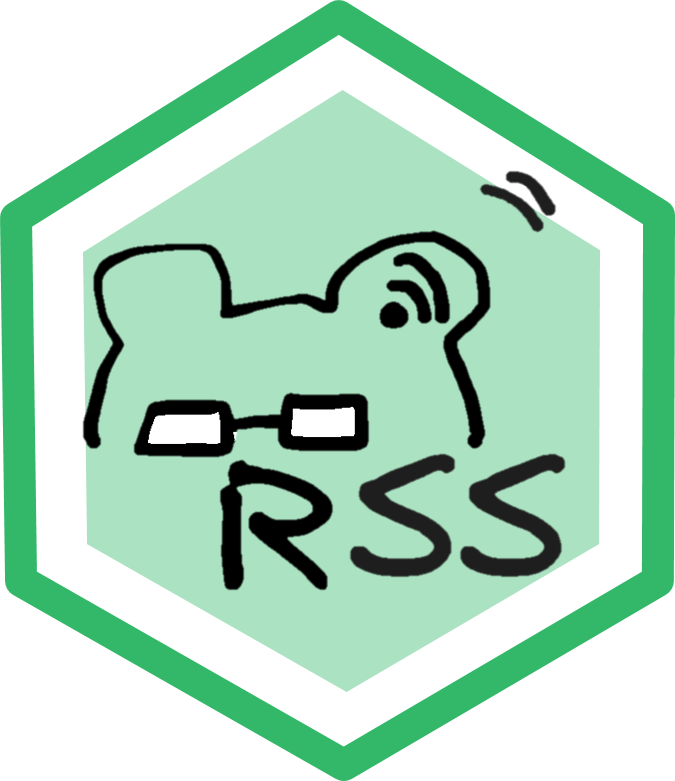

<!-- README.md is generated from README.Rmd. Please edit that file -->

## RSS reader: Keep your academic knowledge up to date!

## Introduction



The package `RSS` is by-product of the journey of author’s PhD.
Hopefully you find these function also useful for you.

## Installation

<!-- The package can be installed from CRAN as follows: -->

``` r
if (!require('devtools')) install.packages('devtools')
devtools::install_github("HU-IGPS/RSS")
# or
if (!require('remotes')) install.packages('remotes')
remotes::install_github("HU-IGPS/RSS")
```

The development version can be installed from github as follows:

## Descriptions

You can customize your RSS feed by modifying the following steps \###
make the feed list

``` r
source("src/feed_list.R")
```

Currently we include the following journals:

|                                      |                              |                                |                 |          |                           |                                  |
|:-------------------------------------|:-----------------------------|:-------------------------------|:----------------|:---------|:--------------------------|:---------------------------------|
| Agricultural Systems                 | Annual plant commuciation    | Field Crops Research           | Nature food     | PNAS bio | PNAS gene                 | Theoretical and Applied Genetics |
| Agricultural and Forest Meteorology  | Crop Science                 | Frontiers in Plant Science     | Nature plant    | PNAS eco | Plant and Soil            | Trends in Ecology & Evolution    |
| Agronomy for Sustainable Development | Euphytica                    | Journal of Experimental Botany | New Phytologist | PNAS env | Plant, Cell & Environment | Trends in Plant Science          |
| Annual Review of Plant Biology       | European Journal of Agronomy | Nature                         | PNAS agri       | PNAS evo | Science                   | scientific report                |

### set regualar task

In this example, it was set to update RSS feed daily

``` r
source("src/schedule_task.R")
```

Content in `schedule_task.R`

``` r
myscript <- paste0(getwd(),"/src/RSS_subscribe.R")

taskscheduleR::taskscheduler_create(taskname = "getRSS", 
                     rscript = myscript, 
                     schedule = "DAILY", starttime = "12:00",
                     startdate = format(Sys.Date()+1, "%m/%d/%Y"))
#> [1] "SUCCESS: The scheduled task \"getRSS\" has successfully been created."
```

<sup>Created on 2023-11-15 with [reprex
v2.0.2](https://reprex.tidyverse.org)</sup>

### get RSS feed

If you don’t want to wait until the next day from 12:00 pm Then you can
run

``` r
source("src/RSS_subscribe.R")
```

### visualization

``` r
source("RSSreader/app.R")
```

## Citing `RSS`

To cite the methods in the package please use: Wang T (2023). RSS: Use
RSS to enrich your academic life. R package version 0.1.0.

    @Manual{,
      title = {RSS: RSS: Use RSS to enrich your academic life.},
      author = {Tien-Cheng Wang},
      year = {2023},
      note = {R package version 0.1.0},
    }
